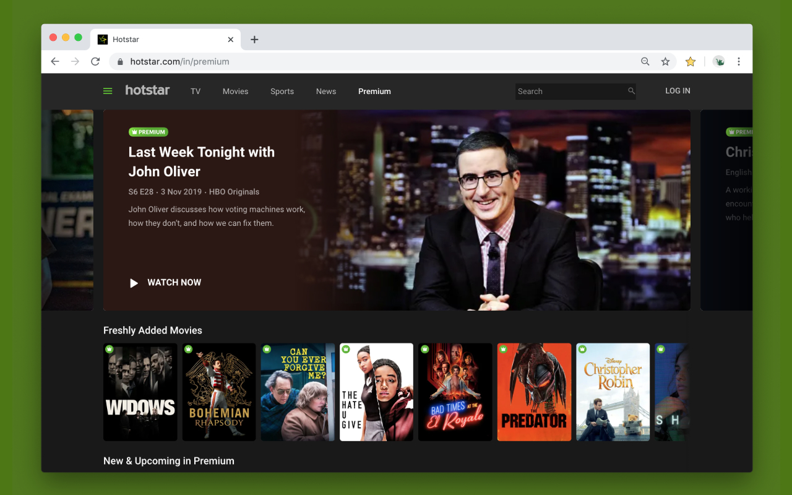
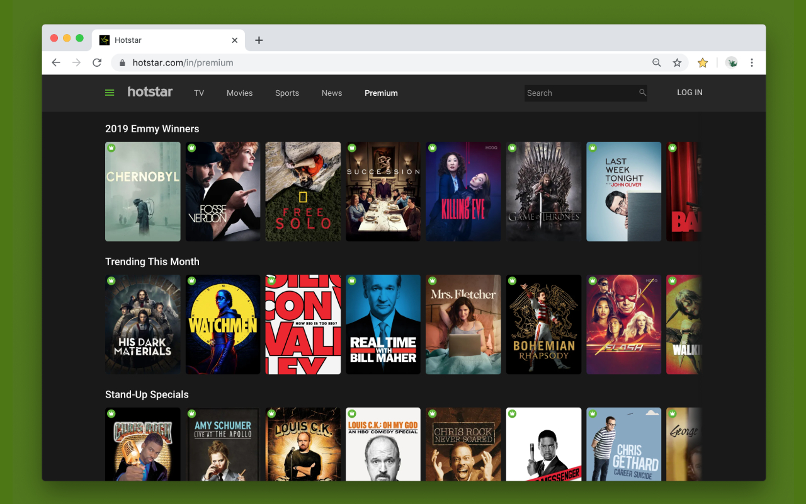
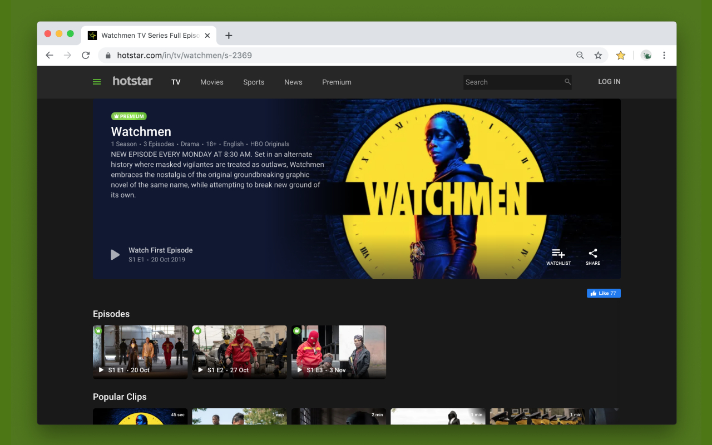

# Hotstar Dark Theme

Dark Theme for Hotstar

## Install

[Chrome Extension](https://chrome.google.com/webstore/detail/hotstar-dark-theme/ilfapohajbnogiilnbbejjhfbbgbplel)

## Preview

  
  
  

## Color contrast

Web Content Accessibility Guidelines (WCAG) AA ✅

## Contributing

Read our [contributing guide](CONTRIBUTING.md) to learn about our development process.

## License

Hotstar Dark Theme is open source software [licensed as MIT](LICENSE).

---

_Star Icon used in extension made by [Freepik](https://www.freepik.com/home) from [www.flaticon.com](http://www.flaticon.com/)._

_Vector illustrations used in extension by [Icons 8](https://icons8.com/)._
